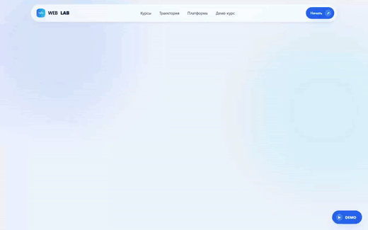
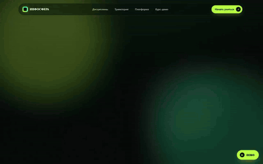
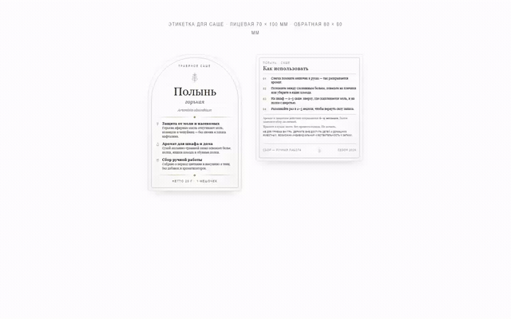
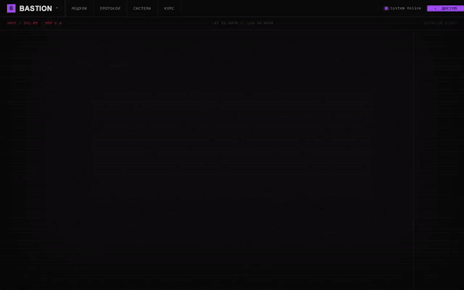

# landing-pages

Четыре учебных и демонстрационных проекта на чистом HTML, CSS и JavaScript.
Без фреймворков, сборщиков и зависимостей: каждый проект открывается двойным
кликом по `index.html`.

Хаб со всеми проектами: [`index.html`](index.html), он же публикуется
через GitHub Pages.

## Проекты

| Проект | Что внутри | Стек |
|---|---|---|
| [`weblab/`](weblab/) | Платформа по веб-технологиям: программа обучения, живые примеры кода, демо-курс | HTML, CSS, JS |
| [`infosfera/`](infosfera/) | Цифровой образовательный ресурс: каталог дисциплин, траектория обучения, интерактивные визуализации алгоритмов | HTML, CSS, JS |
| [`sachet-label/`](sachet-label/) | Печатная этикетка саше: размеры под высечку, пиктограммы в SVG, подготовка к печати | HTML, CSS, SVG |
| [`bastion/`](bastion/) | Система подготовки по информационной безопасности: модули-уроки, реестр модулей, прогресс прохождения, вступительный контроль | HTML, CSS, JS |

## Что показывает

- адаптивную вёрстку от 360 px без медиафреймворков, на флексах и сетках;
- анимации появления блоков и прогресса через `IntersectionObserver` и CSS-переходы;
- интерактив на чистом JS: переключение уроков, подсчёт прогресса, проверка ответов;
- визуализацию алгоритмов сортировки и поиска без сторонних библиотек;
- подготовку вёрстки к печати: физические размеры, высечка, SVG-пиктограммы.

CSS в проектах написан руками, от 15 до 25 КБ на проект, без Tailwind
и Bootstrap.

## Видео-демо

Записи прохода по каждому проекту лежат в [`demo/`](demo/) в mp4. Ниже те же
записи в gif, чтобы играли прямо здесь.

### WEBLAB - платформа по веб-технологиям



[mp4, 14 секунд](demo/weblab.mp4) · [постер](demo/weblab.jpg)

### ИНФОСФЕРА - цифровой образовательный ресурс



[mp4, 15 секунд](demo/infosfera.mp4) · [постер](demo/infosfera.jpg)

### Этикетка саше - подготовка к печати



[mp4, 4 секунды](demo/sachet-label.mp4) · [постер](demo/sachet-label.jpg)

### BASTION - подготовка по информационной безопасности



[mp4, 12 секунд](demo/bastion.mp4) · [постер](demo/bastion.jpg)

## Локальный запуск

Просто открыть `index.html` в браузере. Если нужен http-сервер:

```bash
python -m http.server 8000
```

и зайти на `http://localhost:8000`.

## Структура

```
.
├── index.html          хаб со ссылками на проекты
├── bastion/
├── weblab/
├── infosfera/
├── sachet-label/
└── demo/               mp4-демо и постеры
```
